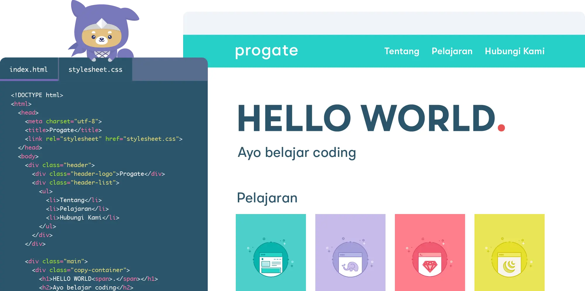
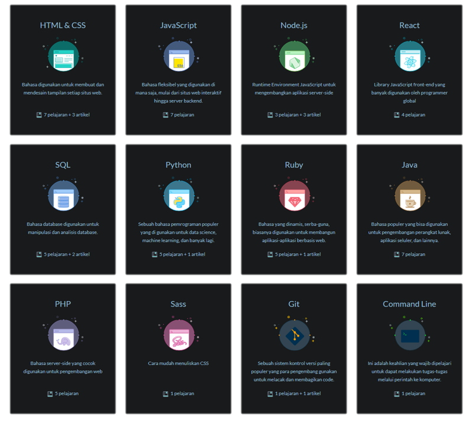

  

<h1 align="center">Progate</h1>

Progate adalah platform pembelajaran pemrograman secara online yang tersedia dalam bahasa Indonesia dan Inggris. Dengan Progate kamu dapat belajar secara mandiri dengan cara yang menyenangkan. Terdapat beberapa course yang tersedia di Progate, seperti HTML, CSS, Python, dan masih banyak lagi

<h2 align="center">Daftar Course</h2>

