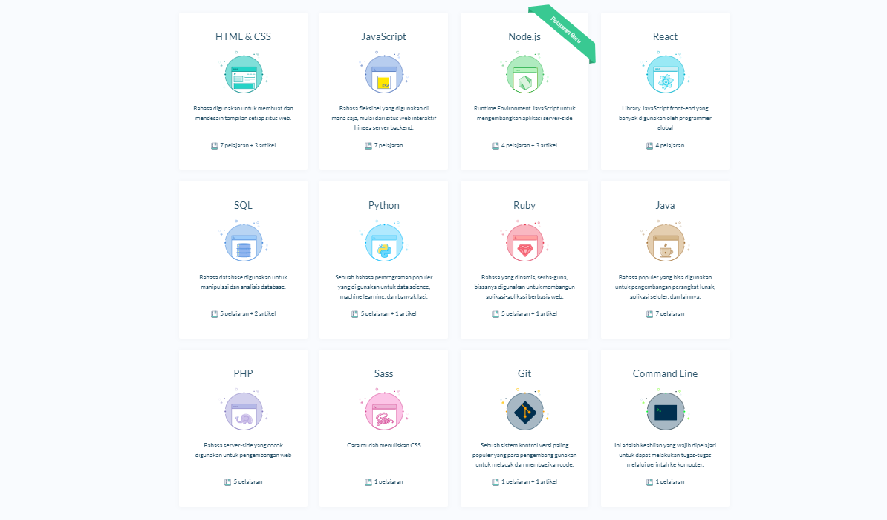

  

<h1 align="center">Progate</h1>

Progate adalah platform pembelajaran pemrograman secara online yang tersedia dalam bahasa Indonesia dan Inggris. Dengan Progate kamu dapat belajar secara mandiri dengan cara yang menyenangkan. Terdapat beberapa course yang tersedia di Progate, seperti HTML, CSS, Python, dan masih banyak lagi

Materi-materi dapat dipelajari oleh pengguna dengan cara yang menyenangkan dan mandiri, tanpa tutor, yang disajikan secara visual dan ringkas, dapat melakukan latihan secara langsung, serta mengumpulkan poin dan naik level di Progate.

Salah satu keunggulan utama belajar coding secara daring di Progate adalah fleksibilitas untuk menyelesaikan kursus dengan kecepatan dan kenyamanan waktu pengguna. Seluruh proses pembelajaran coding di Progate tersimpan di akun pengguna, dan mereka dapat melanjutkan pembelajaran kapan saja dan di mana saja. 

<h2 align="center">Daftar Course</h2>

